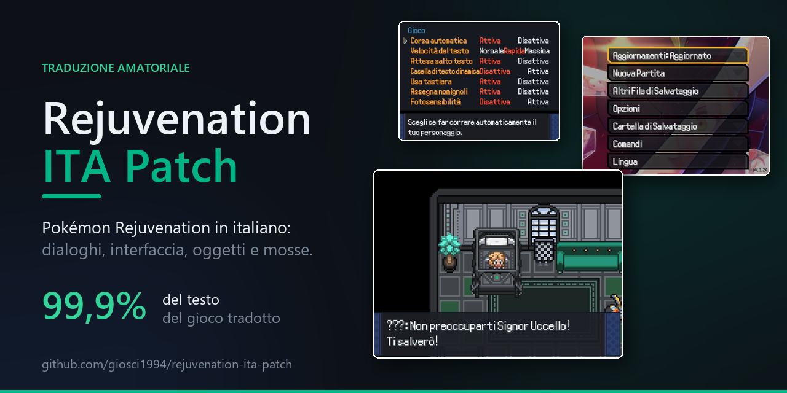
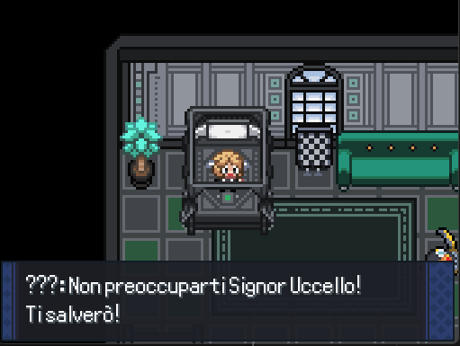
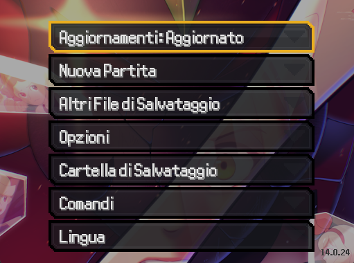
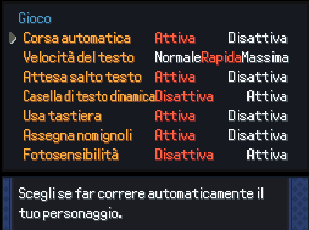
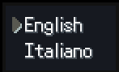

# 🇮🇹 Rejuvenation ITA Patch

**Pokémon Rejuvenation in italiano. Una cartella da copiare, una voce da selezionare, e la storia si legge.**

**🇮🇹 Italiano** · [🇬🇧 English](#english)

Traduzione amatoriale completa di *Pokémon Rejuvenation*: dialoghi, interfaccia, oggetti, mosse, abilità, missioni e Pokédex. Funziona su Windows, Linux, macOS, Android e iOS, perché non tocca il gioco: si appoggia al sistema di traduzione che Rejuvenation ha già dentro.

<p align="center">
  <a href="https://github.com/giosci1994/rejuvenation-ita-patch/releases/latest"></a>
  
  
  
  <a href="LICENSE"></a>
</p>

<p align="center">
  
</p>

---

## ✨ Cosa trovi tradotto

- 💬 **Dialoghi e narrativa** — l'intera trama, cutscene comprese
- 🎒 **Interfaccia** — menu, zaino, squadra, opzioni, messaggi di lotta
- ⚔️ **Mosse, abilità, strumenti, tipi e nature** — con la terminologia ufficiale italiana dei giochi Pokémon
- 📖 **Pokédex, missioni e descrizioni** — voci lunghe comprese
- 🧩 **135.033 stringhe su 135.033**, il 99,9% del testo del gioco

I nomi dei Pokémon e i nomi propri di persone e luoghi restano invariati, come nelle edizioni italiane ufficiali.

---

## 📸 Schermate

<p align="center">
  
  &nbsp;&nbsp;
  
</p>

<p align="center">
  
  &nbsp;&nbsp;
  
</p>

---

## 🚀 Installazione

Ti serve una copia di Pokémon Rejuvenation già installata. Non la trovi qui: scaricala gratuitamente dal sito del suo team di sviluppo.

### Windows, con installer

1. Scarica `rejuvenation-ita-patch.zip` dalla [pagina delle Release](https://github.com/giosci1994/rejuvenation-ita-patch/releases/latest)
2. Estrai lo zip dove preferisci
3. Tasto destro su `installa.ps1` → **Esegui con PowerShell**

L'installer cerca il gioco da solo. Se non lo trova te lo chiede, e puoi trascinarci dentro la cartella.

### 📱 Android · 🍏 iOS · 🐧 Linux · 🍎 macOS

Si copia a mano, ed è la stessa identica procedura su tutti e quattro. Estrai lo zip e metti la cartella `patch` dentro la cartella del gioco, quella che contiene `Data` e `Graphics`:

```
Rejuvenation/
├── Data/
├── Graphics/
└── patch/
    ├── italiano.dat
    ├── Init/intl.rb
    └── Mods/intl.rb
```

Se hai già una cartella `patch` con altre mod, uniscila: non serve cancellare nulla.

**Su Android e iOS funziona così anche se sembra strano**, perché il gioco legge i propri file dalla cartella in cui si trova, su telefono come su computer: niente percorsi speciali, niente permessi di root.

L'unica vera difficoltà è capire *dove* sia quella cartella sul telefono. C'è un modo infallibile per riconoscerla: se hai già giocato almeno una volta, **è l'unica che contiene `Data`, `Graphics` e `Save Data` insieme**.

> 📖 Come trovarla con **JoiPlay, Kirin, Empo o RPG Player**, e cosa fare se Android non ti lascia scrivere nella cartella: **[docs/INSTALLAZIONE.md](docs/INSTALLAZIONE.md)**.

### Poi, in tutti i casi

Avvia il gioco e dal menu principale scegli **Language → Italiano**. La voce è in fondo, sotto *Controls*.

---

## 🗑️ Disinstallazione

Scegli **English** nel menu delle lingue e il gioco torna com'era: la traduzione resta sul disco ma inattiva.

Per toglierla del tutto, cancella i tre file elencati sopra, oppure esegui `.\installa.ps1 -Rimuovi`.

Nessun file originale del gioco viene mai modificato, quindi non c'è nulla da ripristinare.

---

## 🔧 Come funziona

Rejuvenation include un proprio sistema di localizzazione: cerca ogni frase inglese in un dizionario e, se la trova, mostra la traduzione. Questa patch è quel dizionario.

Il vantaggio è che **una stringa non tradotta ricade automaticamente sull'inglese**, quindi la patch non può rompere il gioco e resta utilizzabile anche se il gioco viene aggiornato.

```
Data/messages.dat  ──estrai.py──▶  indice delle stringhe (resta in locale)
                                          │
                        dati/traduzioni.jsonl  (la traduzione, versionata)
                                          │
                                  costruisci.py
                                          ▼
                                patch/italiano.dat
```

I codici di controllo del gioco — `\PN` per il nome del giocatore, `\c[6]` per i colori, `<icon=...>`, i segnaposto `{1}` — vengono mascherati prima della traduzione e rimessi al loro posto dopo. Ogni riga che non li riporta tutti viene scartata invece di entrare nel gioco.

---

## 🤝 Contribuire

Hai trovato una frase tradotta male? È la cosa più utile che puoi segnalare. Apri una issue con la frase inglese e quella italiana, oppure proponi la correzione direttamente: la procedura è in **[CONTRIBUTING.md](CONTRIBUTING.md)**.

Gli strumenti in `strumenti/` sono riutilizzabili per tradurre **qualunque gioco RPG Maker XP basato su Pokémon Essentials**, non solo Rejuvenation.

---

## ⚖️ Diritti

Progetto amatoriale, gratuito, **non affiliato** a Nintendo, Game Freak, Creatures Inc., The Pokémon Company né al team di Rejuvenation.

Non contiene il gioco, né alcuna sua risorsa, né il copione inglese originale. Contiene solo la traduzione italiana e gli strumenti per generarla, seguendo la guida alla traduzione che il team di Rejuvenation distribuisce dentro il gioco stesso.

Zero monetizzazione, ora e in futuro. Rimozione immediata su richiesta dei titolari dei diritti.

Dettagli completi in **[NOTICE.md](NOTICE.md)**.

---

## 🙏 Crediti

Il merito del gioco, della storia e di ogni personaggio è del **team di Pokémon Rejuvenation**, che ha scritto un'opera enorme e l'ha regalata a tutti, guida alla traduzione compresa.

Traduzione italiana a cura di [@giosci1994](https://github.com/giosci1994).

---

<a name="english"></a>

# 🇮🇹 Rejuvenation ITA Patch

**Pokémon Rejuvenation in Italian. Copy one folder, pick one menu entry, and the story reads.**

[🇮🇹 Italiano](#-rejuvenation-ita-patch) · **🇬🇧 English**

A complete fan translation of *Pokémon Rejuvenation* into Italian — dialogue, interface, items, moves, abilities, quests and Pokédex. It runs on Windows, Linux, macOS, Android and iOS, because it changes nothing in the game: it uses the localisation system Rejuvenation already ships with.

## ✨ Coverage

**135,033 of 135,033 strings — 99.9% of the game's text.** Pokémon names and proper nouns are left untouched, as in the official Italian games.

## 🚀 Install

You need your own copy of Pokémon Rejuvenation, which is not distributed here.

1. Download `rejuvenation-ita-patch.zip` from the [latest release](https://github.com/giosci1994/rejuvenation-ita-patch/releases/latest)
2. **On Windows**, extract it and right-click `installa.ps1` → *Run with PowerShell*. **On Android, iOS, Linux and macOS**, extract it and copy the `patch` folder into the game folder — the one holding `Data` and `Graphics`
3. Launch the game, then **Language → Italiano** in the main menu

**Android and iOS need no special path and no root**: the game reads its files from its own folder on phones exactly as it does on desktop. The only tricky part is locating that folder, and there is a foolproof way — once you have played at least once, it is the only one holding `Data`, `Graphics` and `Save Data` together.

Step-by-step instructions for **JoiPlay, Kirin, Empo and RPG Player**, plus what to do when Android refuses to let you write into the folder, are in **[docs/INSTALLAZIONE.md](docs/INSTALLAZIONE.md)** (written in Italian).

To uninstall, pick **English** again, or run `.\installa.ps1 -Rimuovi`. No original game file is ever modified.

## 🔧 How it works

Rejuvenation looks up each English line in a dictionary and shows the translation when it finds one. This patch is that dictionary, so **any untranslated line falls back to English** — the patch cannot break the game and survives game updates.

Game control codes (`\PN`, `\c[6]`, `<icon=...>`, `{1}` placeholders) are masked before translation and restored afterwards. Any line that comes back without all of them is discarded rather than shipped.

The tools in `strumenti/` work with **any RPG Maker XP game built on Pokémon Essentials**, not just Rejuvenation.

## ⚖️ Rights

Unofficial, free, **not affiliated** with Nintendo, Game Freak, Creatures Inc., The Pokémon Company or the Rejuvenation team. Contains no game files, no assets and not the original English script — only the Italian translation and the tools that produce it, following the translation guide the Rejuvenation team ships inside the game.

No monetisation, ever. Immediate takedown on request. Full details in **[NOTICE.md](NOTICE.md)**.

All credit for the game itself goes to the **Pokémon Rejuvenation team**.
